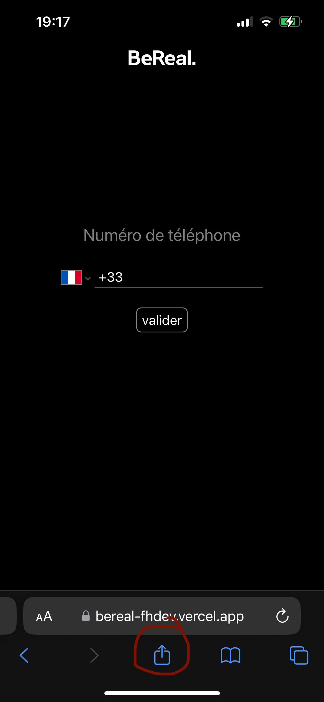
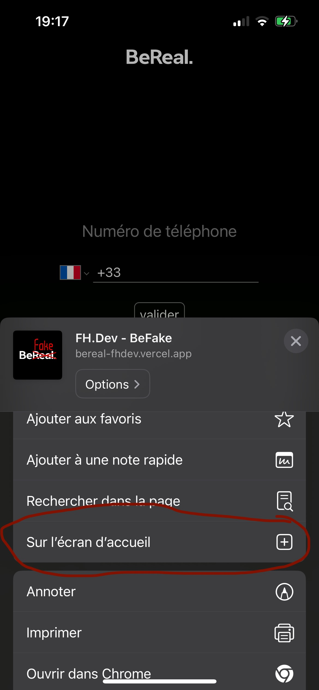

## Project description
This web-based BeReal client serves as a platform for viewing your friends' posts without requiring you to make any posts yourself. Its primary feature lies in its ability to function as a genuine app on any mobile device, providing convenient access for users.

### Features:
1. **Mobile App:** Use it easily on your phone.
2. **View Friends' Posts:** See what your friends are sharing without posting yourself.
3. **Explore Friends-of-Friends:** Discover posts from extended connections by making your own posts.
4. **Silent Screenshots:** Capture BeReal content without notifying the person.
5. **Realmojis and Comments:** Check out realmojis, comments, and tags associated with a post.
6. **Map Locations:** Instantly open the exact location of a BeReal post on maps.

### Todos:
- [ ] Add link to Github
- [ ] Add profile pages
- [ ] Add posting comments feature
- [ ] Add posting realmoji feature
- [ ] Add posting page
- [ ] Make it responsive
- [ ] Improve code structure

## Mobile installation
### Go to url [`bereal-fhdev`](https://bereal-fhdev.vercel.app) and follow these 2 simple steps.    
 

## Code structure
The code structure needs a review as it is currently excessively nested and unclear. For the project to maintain proper mobile compatibility, it is essential to have all components under the same route.

## Local Installation
This is a [Next.js](https://nextjs.org/) project bootstrapped with [`create-next-app`](https://github.com/vercel/next.js/tree/canary/packages/create-next-app).
First, clone this repository:
```bash
git clone https://github.com/FH-DEV1/BeReal
```

Second, move into the repo you just cloned and move in the app directory:
```bash
cd app
```

Third, install dependencies:
```bash
npm install --legacy-peer-deps
```

Finally, run the development server:
```bash
npm run dev
```

Open [http://localhost:3000](http://localhost:3000) with your browser to see the result.
